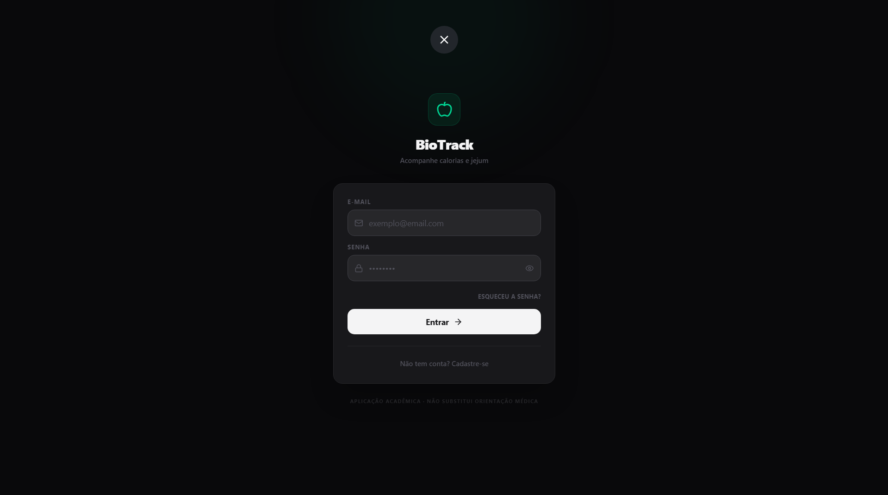
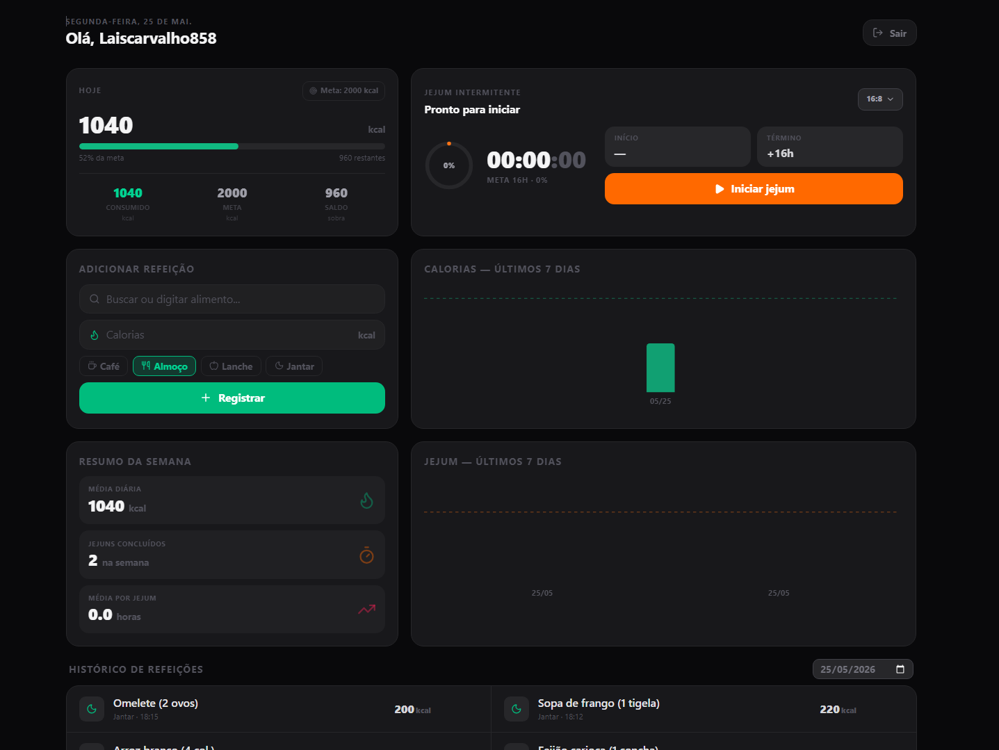

````bash
# 🥗 BioTrack — Registro de Calorias e Jejum Intermitente

Aplicação web full-stack desenvolvida para acompanhamento de consumo calórico e controle de jejum intermitente. O sistema permite registrar refeições, definir metas diárias, acompanhar ciclos de jejum em tempo real e visualizar estatísticas semanais de forma intuitiva.

> ⚠️ Esta aplicação foi desenvolvida para fins acadêmicos e não substitui orientação médica ou nutricional profissional.

---

# 🔗 Deploy

🌐 https://biotrack-app-theta.vercel.app?_vercel_share=rOchxbs5txhB9hwoPop1aGNOm5cZrznY

---

# 🖼️ Screenshots

## 🔐 Tela de Login



## 📊 Dashboard



---

# 🛠️ Tecnologias Utilizadas

| Camada | Tecnologia |
|---|---|
| Framework | Next.js 16 (App Router) |
| Linguagem | TypeScript |
| Autenticação | Firebase Authentication |
| Banco de Dados | Firestore (Firebase) |
| Estilização | Tailwind CSS v4 |
| Gráficos | Recharts |
| Ícones | Lucide React |
| Deploy | Vercel |

---

# ✅ Funcionalidades

## 🔐 Autenticação
- Cadastro de usuários
- Login e logout
- Recuperação de senha
- Proteção de rotas privadas

## 🍽️ Controle Alimentar
- Cadastro de refeições
- Edição e exclusão de registros
- Filtro por data
- Controle de calorias consumidas

## 🎯 Meta Calórica
- Definição de meta diária personalizada
- Barra de progresso dinâmica
- Indicadores visuais de consumo

## ⏳ Jejum Intermitente
- Início e encerramento de jejum em tempo real
- Protocolos prontos:
  - 14:10
  - 16:8
  - 18:6
  - 20:4
  - 24h
  - Personalizado

## 📈 Estatísticas
- Histórico de jejuns concluídos
- Gráfico semanal de calorias
- Gráfico semanal de horas em jejum
- Média diária de calorias
- Tempo médio de jejum semanal

## 📱 Responsividade
- Compatível com dispositivos mobile e desktop

---

# 📦 Instalação Local

## Pré-requisitos

- Node.js 18+
- npm ou yarn
- Conta no Firebase

---

## 1️⃣ Clone o repositório

```bash
git clone https://github.com/SEU_USUARIO/SEU_REPOSITORIO.git
cd SEU_REPOSITORIO
```

---

## 2️⃣ Instale as dependências

```bash
npm install
```

---

## 3️⃣ Configure as variáveis de ambiente

Crie um arquivo `.env.local` na raiz do projeto:

```env
NEXT_PUBLIC_FIREBASE_API_KEY=sua_api_key
NEXT_PUBLIC_FIREBASE_AUTH_DOMAIN=seu_projeto.firebaseapp.com
NEXT_PUBLIC_FIREBASE_PROJECT_ID=seu_projeto
NEXT_PUBLIC_FIREBASE_STORAGE_BUCKET=seu_projeto.firebasestorage.app
NEXT_PUBLIC_FIREBASE_MESSAGING_SENDER_ID=seu_sender_id
NEXT_PUBLIC_FIREBASE_APP_ID=seu_app_id
```

---

## 4️⃣ Configure o Firebase

### Authentication
Ative:
- Login com E-mail e Senha

### Firestore Database
- Crie um banco no modo de produção

---

## 5️⃣ Execute o projeto

```bash
npm run dev
```

Acesse:
```txt
http://localhost:3000
```

---

# 🌍 Variáveis de Ambiente

| Variável | Descrição |
|---|---|
| `NEXT_PUBLIC_FIREBASE_API_KEY` | API Key do Firebase |
| `NEXT_PUBLIC_FIREBASE_AUTH_DOMAIN` | Domínio de autenticação |
| `NEXT_PUBLIC_FIREBASE_PROJECT_ID` | ID do projeto |
| `NEXT_PUBLIC_FIREBASE_STORAGE_BUCKET` | Bucket de armazenamento |
| `NEXT_PUBLIC_FIREBASE_MESSAGING_SENDER_ID` | Sender ID |
| `NEXT_PUBLIC_FIREBASE_APP_ID` | ID da aplicação |

---

# 🚀 Deploy na Vercel

1. Faça push do projeto no GitHub
2. Acesse a Vercel
3. Importe o repositório
4. Configure as variáveis de ambiente
5. Clique em Deploy

---

# 👩‍💻 Autor

Projeto desenvolvido como trabalho final da disciplina de TSI — Senac.

Desenvolvido por Lais Carvalho 💚
````
